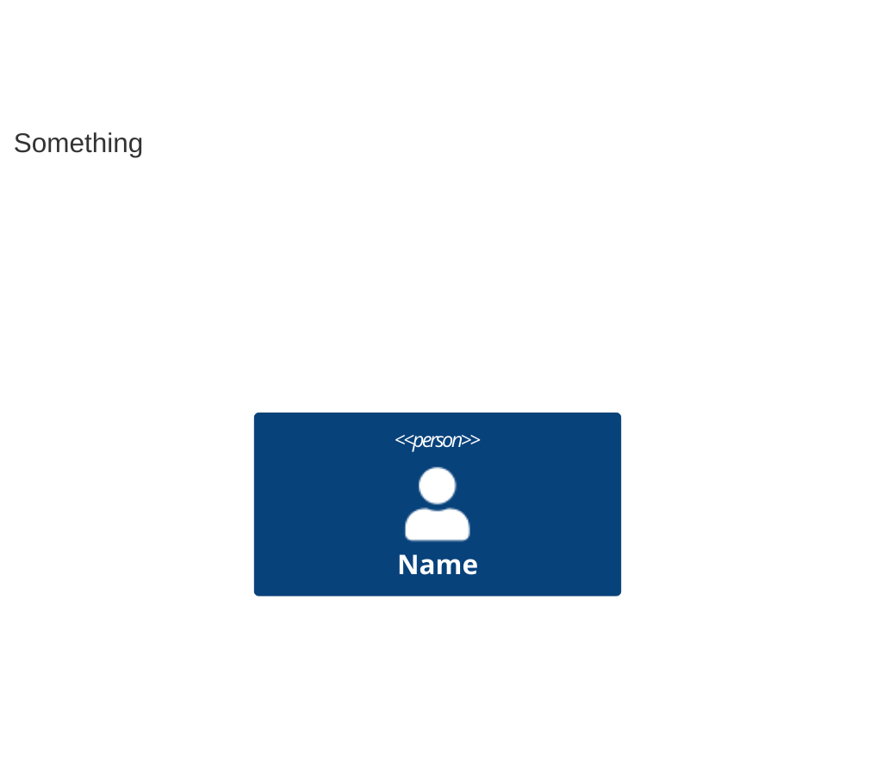

# How to View Mermaid Diagrams

This guide shows you how to view the C4 architecture diagrams in different environments.

## ✅ GitHub (Easiest - No Setup Required)

GitHub has **native Mermaid support**. Just view any `.md` file on GitHub and diagrams render automatically!

**Example**:
1. Push your commits to GitHub
2. Navigate to https://github.com/YOUR-USERNAME/creator-ledger/tree/master/docs/architecture
3. Click any diagram file (e.g., `01-system-context.md`)
4. **Diagrams render automatically!** ✨

**Live Example**: https://github.com/mermaid-js/mermaid/blob/develop/README.md

---

## 🔧 IntelliJ IDEA

IntelliJ has **native Mermaid support** since version 2021.1.

### Check Your Version
1. **Help** → **About**
2. Look for version number (e.g., "2023.3")
3. If **2021.1 or newer** → You have native support! ✅

### Enable Markdown Preview (if needed)
1. Open any `.md` file in `docs/architecture/`
2. Look for the **preview pane** on the right side
3. If you don't see it:
   - Right-click the editor tab
   - Select **"Split and Move Right"** or press `Ctrl+Shift+P` (Windows/Linux) or `Cmd+Shift+P` (Mac)
   - Or click the split icon in the top-right corner

### View the Diagrams
1. Open `docs/architecture/01-system-context.md`
2. The preview pane shows the rendered diagram
3. Scroll through the document - diagrams update automatically!

### Troubleshooting IntelliJ

**If diagrams don't render:**

1. **Check Markdown plugin is enabled**:
   - **File** → **Settings** → **Plugins**
   - Search for "Markdown"
   - Ensure **"Markdown"** plugin is enabled
   - Restart IntelliJ if you enabled it

2. **Update IntelliJ**:
   - If version is older than 2021.1, update to latest version
   - **Help** → **Check for Updates**

3. **Try the Mermaid plugin (optional)**:
   - **File** → **Settings** → **Plugins**
   - Search for "Mermaid"
   - Install **"Mermaid"** plugin by Dmitry Kandalov
   - Restart IntelliJ

4. **Clear caches**:
   - **File** → **Invalidate Caches**
   - Select **"Invalidate and Restart"**

---

## 💻 VS Code

Install the **Markdown Preview Mermaid Support** extension:

### Installation
```bash
code --install-extension bierner.markdown-mermaid
```

Or via UI:
1. Open Extensions (Ctrl+Shift+X)
2. Search for "Markdown Preview Mermaid Support"
3. Click **Install**

### View Diagrams
1. Open any `.md` file
2. Press `Ctrl+Shift+V` (Windows/Linux) or `Cmd+Shift+V` (Mac)
3. Or click the preview icon (top-right corner)
4. Diagrams render in the preview!

---

## 🌐 Online Viewers (No Installation)

### Mermaid Live Editor
1. Go to https://mermaid.live/
2. Copy the Mermaid code from any diagram file
3. Paste into the editor
4. Diagram renders instantly
5. Can export as PNG, SVG, or share link

### GitHub Gist
1. Create a new gist at https://gist.github.com/
2. Name file with `.md` extension
3. Paste the Markdown content (including Mermaid blocks)
4. Click **Create public gist**
5. Diagrams render automatically!

---

## 📱 Mobile Viewing

### GitHub Mobile App
- Download GitHub app (iOS/Android)
- Navigate to the repository
- Open any diagram file
- **Diagrams render automatically!** ✅

### Browser
- Open GitHub in mobile browser
- Navigate to diagram files
- Diagrams render (may need to zoom)

---

## 🧪 Test Your Setup

Try opening these files to test rendering:

1. **Simple diagram**: [01-system-context.md](./01-system-context.md)
2. **Complex diagram**: [02-container.md](./02-container.md)
3. **Detailed diagram**: [03-component-user.md](./03-component-user.md)

### Expected Result
You should see:
- ✅ **Boxes** representing components/systems
- ✅ **Arrows** showing relationships
- ✅ **Labels** on arrows
- ✅ **Titles** at the top
- ✅ **Color-coded** elements (people, systems, databases)

### If You See Raw Code


Then Mermaid rendering is **not working**. Follow troubleshooting steps above.

---

## 🎨 Diagram Colors (C4 Standard)

C4 diagrams use standard colors:
- **Blue**: Person/User
- **Dark Blue**: Internal System/Container
- **Gray**: External System
- **Light Blue**: Component
- **Green**: Database

---

## 📝 Editing Diagrams

### Recommended Workflow
1. **Edit in IDE** (IntelliJ/VS Code) with preview
2. **See changes live** as you type
3. **Commit to Git**
4. **View on GitHub** for final check

### Mermaid Syntax Help
- Official docs: https://mermaid.js.org/
- C4 diagrams: https://mermaid.js.org/syntax/c4.html
- Live editor with examples: https://mermaid.live/

---

## ✅ Verification Checklist

- [ ] Can view diagrams in GitHub ✨ (works automatically)
- [ ] Can view diagrams in IntelliJ (native support)
- [ ] Can view diagrams in VS Code (with extension)
- [ ] Can edit and see live preview
- [ ] Diagrams render correctly with colors and layout

---

## 🆘 Still Having Issues?

1. **Check Mermaid syntax**: Copy into https://mermaid.live/ to validate
2. **Check file extension**: Must be `.md` (Markdown)
3. **Check code fences**: Must use triple backticks with `mermaid` language tag:
   ````markdown
   ```mermaid
   C4Context
     ...
   ```
   ````
4. **Update your tools**: Ensure latest version of IntelliJ/VS Code

**GitHub always works** - when in doubt, push to GitHub and view there! 🚀
